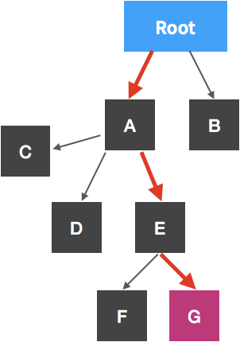

# REACT 개요

- MVC구조에서 View에만 관심이 있다.
- View 부분을 컴포넌트로 구성... 따라서 컴포넌트 단위로 재사용이 가능.
- View만 담당하기때문에 라우팅 등의 기능들은 라이브러리 사용해서 구현.
- 데이터가 변할 때 마다 기존 뷰를 날려버리고 처음부터 새로 렌더링.

## 렌더링?

- 렌더링: 사용자 화면에 뷰를 보여주는 것

1. 초기 렌더링

   ```JSX
   render() { ... }
   ```

   컴포넌트가 어떻게 생겼는지 정의. 뷰의 생김새와 어떻게 작동하는지 등의 정보를 지닌 객체를 반환한다.

2. 리렌더링

   데이터 업데이트 시, render 함수 를 또 다시 호출하고 이전 컴포넌트 정보와 현재 컴포넌트 정보와 비교해서 DOM트리 업데이트.

## Virtual DOM

1. 데이터가 업데이트 되면 전체 UI를 Virtual DOM에 업데이트
2. 이전 Virtual DOM에 있던 내용과 현재 내용 비교
3. 바뀐 부분만 실제 DOM에 업데이트

> 지속적으로 데이터가 변화하는 대규모 애플리케이션 구축하기

즉, 작업이 간단할 때 리액트를 안 쓰는 게 더 간단한 경우도 있다

## JSX문법 (JS와 차이점 위주)

### 오류나는데 왜죠...? ㅠㅠ

```JSX
class App extends Component {
  render() {
    return (
      <h1>Hello</h1>
      <h2>World</h2>
    );
  }
}
```

오류! Virtual DOM에서 변화 감지할 때 효율적으로 비교하기 위해 컴포넌트 내부는 DOM 트리구조 하나여야 한다.  
따라서 부모 요소`<div></div>`로 감싸야 한다.

### if 쓰면 외않되요?

- 조건부 연산자 (삼항 연산자)  
  `{condition ? "TRUE" : "FALSE"}`

```JSX
class App extends Component {
  render() {
    const condition = true;
    return (
      <div className="my-div">
        {condition ? "TRUE" : "FALSE"}
        {condition && "조건부 렌더링"}
      </div>
    );
  }
}
```

- && 사용한 조건부 렌더링  
  `{condition && "조건부 렌더링"}`  
  조건이 true일 경우에는 && 이후에 위치한 expression을 반환하고, false일 경우 expression을 반환하지 않고 무시.

- class대신 className  
  `<div className="my-div">`

## 컴포넌트

### 모듈 내보내기

```JSX
export default MyComponent
```

### 모듈 불러오기

```JSX
import MyComponent from './MyComponent' //컴포넌트 파일 불러오기
...
...
class App extends Component {
    render() {
        return <MyComponent />; //불러온 컴포넌트 사용하기. 조립조립
    }
}
```

### props

- 컴포넌트 속성을 설정할 때 사용하는 요소.
- 컴포넌트를 불러와 사용하는 부모 컴포넌트에서만 설정 가능.
- 부모 컴포넌트에서 설정해서 자식 컴포넌트에서 정보를 받아 사용.

부모 컴포넌트에서 설정은 이렇게...
`<MyComponent name="헬로월드" age="999"/>`

자식 컴포넌트에서 사용은 이렇게...
`{this.props.name}`

### defaultProps 과 propTypes

- defaultProps  
   props의 기본값 지정.

- propTypes  
   props의 타입을 지정.

```JSX
import React, { Component } from "react";
import PropTypes from "prop-types"; //검증하자
class MyComponent extends Component {
    render() {
        return (
            <div>
                <p>부모가 지어준 이름은요 {this.props.name} 입니다</p>
                <p>나이는요 {this.props.age} 살 입니다</p>
            </div>
        );
    }
}

MyComponent.defaultProps = {
    name: "아무개" //default를 지정할 수 있다
};

MyComponent.defaultProps = {
    name: PropTypes.string, //prop 타입을 문자열로 설정
    age: PropTypes.number.isRequired //prop 타입은 숫자이고 꼭 있어야 해
};

export default MyComponent;
```

### state

- 컴포넌트 내부에서 자신의 상태를 제어할 수 있음. 굳이 부모에서 설정 안해도 되는 것들.

```JSX
import React, { Component } from "react";

class MyComponent extends Component {
    constructor(props) {
        super(props);
        this.state = {
            number: 777
        };
    }
    /* 보통 이렇게 쓰는듯
    state = {
        number: 777
    }
    */

    state = {
        number: 0
    };

    render() {
        return (
            <div>
                <button
                    onClick={() => {
                    this.setState({
                        number: this.state.number + 1
                    });
                    }}
                />
                <p>{this.state.number}</p>
            </div>
        );
    }
}

export default MyComponent;
```

- `constructor()`  
  state 초깃값 설정 시 사용.  
  근데 보통 `state={...}` 이렇게 쓰는듯.

- `setState()`  
  state 값 업데이트 할 때 사용.
  state 값 변경시키고 싶으면 setState()를 거쳐야한다. 직접변경 안돼.  
  호출 될 때마다 `render()`발생.

### props? state?

둘 다 컴포넌트에서 사용하거나 렌더링할 데이터를 담고있다.
차이점?

- props  
  부모 컴포넌트가 설정.

- state  
  컴포넌트 자체적으로 지닌 값으로써 컴포넌트 내부에서 값을 업데이트.

## 이벤트 핸들링

- JS와 유사. 어려울 것 없다아

```JSX
  import React, { Component } from "react";

      class MyComponent extends Component {
          state = {
              message: ""
          };

          handleChange = e => {
              this.setState({
                  message: e.target.value
              });
              console.log(e.target.value);
          };

          handleClick = () => {
              alert(this.state.message);
              this.setState({
                  message: ""
              });
          };
          render() {
              return (

              <div>
                  <input
                      type="text"
                      name="message"
                      placeholder="키미노 나마에와"
                      value={this.state.message}
                      onChange={this.handleChange}
                      />
                  <button onClick={this.handleClick}>click!</button>
              </div>
              );
          }
      }
      export default MyComponent;
```

## 컴포넌트 반복

반복되는 컴포넌트는 어떻게 렌더링할까?
JS 배열 객체 내장 함수 `map()`을 이용.

### map()과 key

key값을 설정함으로써 원소에 어떤 변화가 일어났는지 더욱 빠르게 알아낼 수 있다.
아래 예제에서 key는 배열의 index

```JSX
import React, { Component } from "react";

class MyComponent extends Component {
  state = {
    names: ["맑음", "흐림", "비", "눈", "강풍"]
  };

  handleChange = text => {
    this.setState({
      name: text.target.value
    });
  };

  handleInsert = () => {
    this.setState({
      names: this.state.names.concat(this.state.name)
    });
  };

  render() {
    const nameList = this.state.names.map((name, index) => (
      <li key={index}>{name}</li>
    ));
    return (
      <div>
        <input onChange={this.handleChange} value={this.state.name} />
        <button onClick={this.handleInsert}>Click!</button>
        <ul>{nameList}</ul>
      </div>
    );
  }
}
export default MyComponent;
```

### this.state.names.concat()? 왜 push()를 안써?

push() 쓰면 기존 배열 자체가 변형된다. 리렌더링을 수반하지 않기 때문에 기존배열에 새값을 더한 배열을 새로 생성하는 concat() 사용해야 한다.

## 컴포넌트의 라이프사이클 메소드

### 라이프사이클

- 마운트, 업데이트, 언마운트

1. 마운트 : 페이지가 컴포넌트에 나타남

   - `constructor`  
     컴포넌트 새로 만들때마다 호출되는 클래스 생성자 메소드

     ```JSX
     constructor(props) { ... }
     ```

     초기 state 설정할 때 사용했었죠?

   - `getDerivedStateFromProps`  
     props에 있는 값을 state에 동기화하는 메소드

     ```JSX
     getDerivedStateFromProps(nextProps, prevState) { // props에서 받아온 값을 state에 동기화
         if(nextProps.value !== prevState.value) { // props의 값이 바뀌었다면
             return {value: nextProps.value}; //값을 변경해라
         }
         return null; //아니면 말고
     }
     ```

   - `render`  
     준비한 UI를 렌더링하는 메소드

     ```JSX
     render() { ... }
     ```

     주의! state 직접 변형하면 안된다. 웹브라우저에 접근해서도 안된다! -> `componentDidMount` 쓰셍.

   - `componentDidMount`  
     컴포넌트가 브라우저에 나타난 후 호출하는 메소드

     ```JSX
     componentDidMount() { ... }
     ```

     컴포넌트 생성 후 첫 렌더링을 다 마치면 실행.
     다른 JS 라이브러리 또는 프레임워크 함수 호출하거나 `setTimeout`, `setInterval` 같은 비동기 작업 처리

2. 업데이트 : 리렌더링을 통해 컴포넌트 정보를 업데이트
   props, state가 바뀌거나 부모 컴포넌트가 리렌더링 되거나 `this.forceUpdate`로 강제로 렌더링할때 컴포넌트가 업데이트 된다.

   - `getDerivedStateFromProps`  
     아까 마운트에서도 봤었는데? ㅇㅇ props 바뀌어서 업데이트할 때도 호출.

   - `shouldComponentUpdate`  
     리렌더링 할까?말까? false가 반환되면 아래 메소드들은 호출되지 않음.

     ```JSX
     shouldComponentUpdate(nextProps, nextState) { ... }
     ```

     props나 state를 변경했을 때, 리렌더링을 시작할지 여부를 지정하는 메소드로 true 또는 false를 반드시 반환해야 한다.
     default는 true. false가 반환되면 업데이트 작업은 여기서 중지. 컴포넌트 최적화 시 사용.
     `this.props`, `this.state`, `nextProps`, `nextState`로 현재 또는 새로 설정 될 props, state에 접근 가능

   - `render`  
     컴포넌트 리렌더링.

   - `getSnapshotBeforeUpdate`  
     컴포넌트 변화된 내용을 DOM에 반영하기 직전!에 호출.

   ```JSX
   getSnapshotBeforeUpdate(prevProps, prevState) { //스크롤바 위치 유지
       if(prevState.array !== this.state.array) {
           const {scrollTop, scrollHeight} = this.list
           return {scrollTop, scrollHeight};
       }
   }
   ```

   업데이트 하기 직전의 값을 참고할 일이 있을 때 사용.
   return값은 `componentDidUpdate`의 snapshot 파라미터로 전달된다.

   - `componentDidUpdate`  
      컴포넌트 업데이트 작업 끝난 후 호출.

   ```JSX
   componentDidUpdate(prevProps, prevState, snapshot) { ... }
   ```

   `prevProps`, `prevState`로 이전에 가졌던 데이터에 접근 가능.

3. 언마운트 : 페이지에서 컴포넌트가 사라짐

   - `componentWillUnmount`  
     컴포넌트가 브라우저에서 사라지기 전에 호출.

     ```JSX
     componentWillUnmount() {...}
     ```

     컴포넌트를 DOM에서 제거할 때 실행된다.

## 컴포넌트 리렌더링 최적화

리액트가 어떤 DOM을 변경할지 인지하려면 Virtual DOM에 모두 렌더링 해보는 과정을 거친다.  
이 때, 불필요한 렌더링이 생길 수 있고 큰 프로젝트면 막아야 한다.

뭘로? `shouldComponentUpdate`로!  
Virtual DOM에 렌더링하는 과정에서 render() 함수를 실행하지 않아 이전 DOM정보 그대로 쓰기 때문에 자원 낭비 방지.

## Redux

보통 리액트 프로젝트... 부모 컴포넌트가 중간자 역할을 해서, props를 통해 변경값 등을 전달
내부 컴포넌트끼리는 소통 X(할수는 있는데 복잡하고 권장되지 않는 방식)

  
루트에서 G 컴포넌트에 값 전달하고 싶을 때, A->E->G 거쳐야 함.  
비효율적. 변수 이름이라도 바뀌면...? E에게는 필요없는 props인데 단지 G에게 전달하기 위해 props들을 선언해야 한다거나...

### 효율적으로 상태 관리를 할 수 있는 라이브러리

Redux, MobX  
리덕스는 상태값을 컴포넌트에 종속시키지 않고, 상태 관리를 컴포넌트 바깥에서 한다!

1. 스토어  
   애플리케이션의 상태 값들을 가지고 있음.  
   스토어는 항상 단 한 개. 단, 리듀서를 여러개 만들 수는 있다.
2. 액션  
   상태 변화를 일으킬 때 참조하는 객체.  
   근데 액션 새로 만들 때마다 직접 객체 만들면 귀찮으니까 액션 생성 함수(action creator) 이용.
3. 디스패치  
   액션을 스토어에 전달하는 것.
4. 리듀서  
   상태를 변화시키는 로직이 있는 함수.  
   state(현재 상태), action(액션 객체)를 파라미터로 받아서 새로운 상태객체 만들어 반환
5. 구독  
   스토어값이 필요한 컴포넌트는 스토어를 구독하고 있음.

리덕스의 상태인 state 값은 읽기 전용이라 직접 수정해서는 안된다.  
상태 업데이트 시, 새 상태 객체를 만들어서 넣어줘야 한다.
